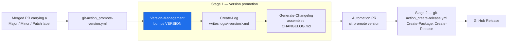

# **ActionLibrary Version Management**

| **Home**
| [Changelog](./CHANGELOG.md)
| [Contributing](./CONTRIBUTING.md)
| [Tech Doc](./techdoc.md)
| <!-- End Of Menu -->

---

Composite GitHub Action that promotes semantic versions. It reads the promotion marker from a merged pull request — a `Major`, `Minor` or `Patch` label, with PR-title and commit-message fallbacks — bumps the matching `VERSION` file(s), and commits the result as `github-actions[bot]`. It supports a single root `VERSION` file and monorepo layouts with per-feature `VERSION` files discovered from the PR's changed paths.

## Position in the release chain

This action is the **first link of stage 1** of the Nexus promote-version chain. The `git-action_promote-version.yml` workflow runs it on an automation branch; the `VERSION` bump it produces is what [Create-Log](https://github.com/crosswave-technology/ActionLibrary-Create-Log) names its `logs/<version>.md` fragment after, and what stage 2 ultimately releases.



## Quickstart

The repository must be checked out first; `gh` and `git` are present on GitHub-hosted runners.

```yaml
jobs:
  promote:
    runs-on: ubuntu-latest
    permissions:
      contents: write
      pull-requests: read
    steps:
      - uses: actions/checkout@34e114876b0b11c390a56381ad16ebd13914f8d5 # v4
      - name: Version Management
        uses: crosswave-technology/ActionLibrary-Version-Management@v1.0.0
        with:
          pr_number: ${{ github.event.pull_request.number }}
          version_file: VERSION     # optional — discovery applies when omitted
          push_changes: "false"     # optional — default "true"
```

All three inputs are optional: `pr_number` enables label lookup and per-feature discovery, `version_file` pins a specific target, and `push_changes: "false"` leaves the commit unpushed so a wrapping workflow (as in the Nexus estate) can push the automation branch itself. `GH_TOKEN` or `GITHUB_TOKEN` must be available in the environment.

## Navigation

- [techdoc.md](./techdoc.md) — promotion and discovery algorithms, input contract, `VERSION` format, limitations.
- [CHANGELOG.md](./CHANGELOG.md) — assembled release history (generated; do not hand-edit).
- [logs/](./logs/) — canonical release-note fragments.
- [CONTRIBUTING.md](./CONTRIBUTING.md) — change and testing workflow.
- Downstream in the chain: [ActionLibrary-Create-Log](https://github.com/crosswave-technology/ActionLibrary-Create-Log) · [ActionLibrary-Generate-Changelog](https://github.com/crosswave-technology/ActionLibrary-Generate-Changelog) · [ActionLibrary-Create-Package](https://github.com/crosswave-technology/ActionLibrary-Create-Package) · [ActionLibrary-Create-Release](https://github.com/crosswave-technology/ActionLibrary-Create-Release)

---

<h6 style="text-align: center;">Copyright &copy; Crosswave Technology Ltd</h6>

*Nexus docs-restructure mission · 2026-08-04 · pending Sean review.*
